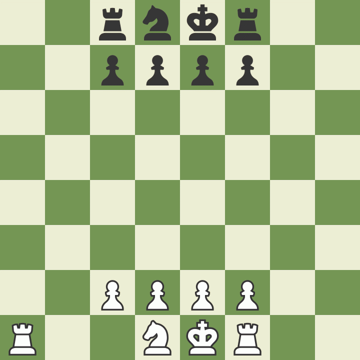

# Neural Network for Chess Position Evaluation 

In this project we tried to create a simple neural network, which predicts who is currently winning in a chess game. The project also involves creating our own datasets with the help of [Stockfish](https://stockfishchess.org) the strongest chess engine at the time, and the ability to play against the trained neural network. Because this is a student project, and therefore used limited resources, we decided to focus on "mini chess", a chess variation with less pieces to make the training process easier and faster. 
 
Neural Network vs. Random Moves            |  Neural Network vs. Stockfish (Elo=200)|  Neural Network vs. Stockfish (Elo=200)
:-------------------------:|:-------------------------:
  |   

## Disclaimer 
This project is a University Project for the Course [Neural Networks](https://www.unisi.it/ugov/degreecourse/480727) at the [Università degli Studi di Siena](https://www.unisi.it).

The main focus was on the neural network which returns to probability of winning the chess game, given a certain board state. The `Experiments` folder has a lot of files that were used to play around with neural networks and get more familiar with it. We decided to not delete it, to give an insight about our learning, but the content of that folder is not supposed to be to high standards, nor has it comments, and will not be prepared by us for the exam. We also decided to play around with reinforcement and tried to implement it also for minichess. This topic was not part of the lecture, so we used ressources on the internet to get familiar with the topic.

## Getting Started
### Installing

To install all the libraries that we are using run pip install with the requirements.txt

```
pip install -r requirements.txt
```
### Neural Network to predict winning probabilities

To start creating your own data you can execute the dataCreation.py file.

```
python dataCreation.py --amount=10 --random=0.5
```

After creating the data you can train the model with the train.py file.

```
python train.py --epoch=1 --batch=100 --dataset=data/minichess/minichess.csv --name=models/minichess/minichess.pt --lr=0.1
```

The final step is now to play against the trained model, or let the trained model play against a bot.

```
python play.py --model=models/minichess/minichess.pt --play=n
```
### Reinforcement Learning
To start creating your own data you can execute the reinforcement.py file with the following parameter:

```
python reinforcement.py --mode=examples
```
After creating the data you can train the model with the train.py file.

```
python reinforcement.py --mode=train --epochs=10 --batch=600 --name=reinforcement.pt --dataset=training.csv --lr=0.001 --epsilon=0.95 --gamma=0.95 --enemy-elo=1000
```
The final step is to let the trained model play against a random player.
You can limit the number of turns per player with `--turns`.
```
python play_reinforcement.py --model=reinforcement.pt --turns=20 
```


## Authors

* **Silas Ueberschaer** - [Deischox](https://github.com/Deischox)

* **Benjamin Pöhlmann** - [Bepo1337](https://github.com/Bepo1337)
